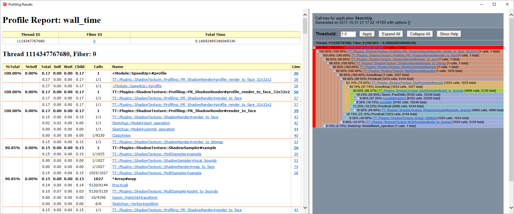
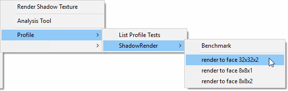
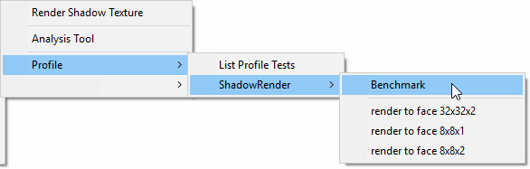
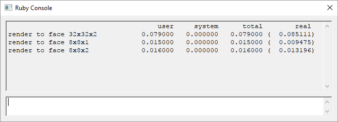

# RubyProf wrapper for SketchUp

**NOTE: This is work in process. Early stages and things will change.**

This is a profiling tool for SketchUp Ruby extensions. It wraps [`Benchmark`](https://ruby-doc.org/stdlib-2.2.4/libdoc/benchmark/rdoc/Benchmark.html) and the [`RubyProf`](https://github.com/ruby-prof/ruby-prof) gem.



## UI
The extension adds a new sub-menu at:
`Extensions > Developer > SpeedUp` (From SketchUp 2021.1)
`Extensions > SpeedUp` (Before SketchUp 2021.1)

## Setup

[RubyProf](https://github.com/ruby-prof/ruby-prof) is a gem that needs to be compiled as it's installed. This prevents it from being installed from within SketchUp under Windows. To compile gems you need the [Ruby DevKit](https://rubyinstaller.org/add-ons/devkit.html) to be configured for the compiler.

Additionally the gem started misbehaving in SketchUp 2017 and up. The profiler isn't able to display the results correctly, thinking there are more threads running. A workaround has been to hack the gem into being single threaded: https://github.com/thomthom/ruby-prof/

To make it easier for SketchUp extension developers this extension bundles pre-compiled versions of RubyProf and will attempt to install it into SketchUp's gems directory.

To initialise this process, you need to run the `Setup` command from the sub-menu at:
`Extensions > Developer > SpeedUp > Setup` (From SketchUp 2021.1)
`Extensions > SpeedUp > Setup`  (Before SketchUp 2021.1)

If you have not run setup, you will see something like this in the Ruby Console:
```
Warning: SpeedUp was unable to activate the ruby-prof gem.
Warning: SpeedUp was unable to load ruby-prof
```

### Compatibility / Version Chart

| SketchUp | Ruby | ruby-prof (Win) | ruby-prof (Mac) |
| --- | --- | --- | --- |
| SU2021.1+ | 2.7.2+ | 1.4.3 | 1.4.3 |
| SU2021.0 | 2.7.1 | [bugged](https://bugs.ruby-lang.org/issues/17152) | [bugged](https://bugs.ruby-lang.org/issues/17152) |
| SU2019.0+ | 2.5+ | 1.4.3 | 1.4.3 |
| SU2017.0+ | 2.2+ | 0.16.2 | 0.17.0 |
| SU2014.0+ (64bit) | 2.0+ | 0.16.2 | n/a |
| SU2014.0+ (32bit) | 2.0+ | 0.15.1 | n/a |

The varying ruby-prof versions for older versions vary due to challenges compiling older versions.

## Creating performance tests

### Profiling

Similar to how you create test units using `Minitest` (Or [TestUp](https://github.com/SketchUp/testup-2) tests), you create profile tests by inheriting from `SpeedUp::ProfileTest`.

**Example profile test case**

```ruby
require 'speedup.rb'

module Example
  # Put your profile tests in a namespace to allow SpeedUp to discover all
  # tests related to that namespace.
  module Profiling
    # The class name is what will be used as the group name for the tests.
    # PR_ShadowRender will display as "ShadowRender" in the menus
    # that `SpeedUp.build_menus` generates.
    class PR_ShadowRender < SpeedUp::ProfileTest

      def setup
        # Setup code here. This is run before every test.
      end

      def teardown
        # Teardown code here. This is run after every test.
      end

      # Any method starting will "profile_" will be treated as a profile
      # test.

      def profile_render_to_face_8x8x1
        # Code you want to profile here.
      end

      def profile_render_to_face_8x8x2
        # Code you want to profile here.
      end

      def profile_render_to_face_32x32x2
        # Code you want to profile here.
      end

    end # class
  end # module
end # module
```

```ruby
module Example
  menu = UI.menu('Plugins').add_submenu('Example')
  menu_profile = menu.add_submenu('Profile')
  # This line will scan the Example::Profiling module for
  # `SpeedUp::ProfileTest` derived classes and build menus for them.
  SpeedUp.build_menus(menu_profile, Example::Profiling)
end # module
```

Full example: https://github.com/thomthom/shadow-texture/blob/master/profiling/PR_ShadowRender.rb



### Benchmarking

Profiling adds overhead to the code you run. If you want to get a notion of the actual time it takes you can run the profile tests with `Benchmark`.





## Running from the console

For quick profiling that you don't want to save with the project and run again later, SpeedUp can be used from the Ruby Console.

```ruby
def fibonacci(number)
  return number if number == 0
  return number if number == 1

  fibonacci(number - 1) + fibonacci(number - 2)
end

SpeedUp.profile { fibonacci(20) }
```
